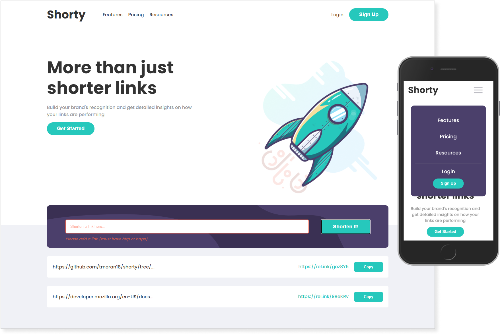

<h1 align="center">Shorty - URL Shortening Landing Page built in React</h1>

<p align="center">A React App I built using the rel.ink API to shorten URLs. The design and assets were provided by <a href="https://www.frontendmentor.io/challenges">FrontEnd Mentor.</a><br>The rocket image was provided by <a href="https://lukaszadam.com/illustrations">Lukasz Adam</a>.</p>



<p align="center">
    <a align="center" href="https://shorty-links.netlify.app/" target="_blank">Live Demo - Shorty Links - URL Shortner</a>
</p>
<p align="center">
    <a align="center" href="https://www.frontendmentor.io/challenges/url-shortening-api-landing-page-2ce3ob-G" target="_blank">Original Challenge - Frontend Mentor URL Shortening API Landing Page</a>
</p>

### Installation

```bash
git clone https://github.com/tmoran18/shorty.git
cd shorty
npm i
npm start
